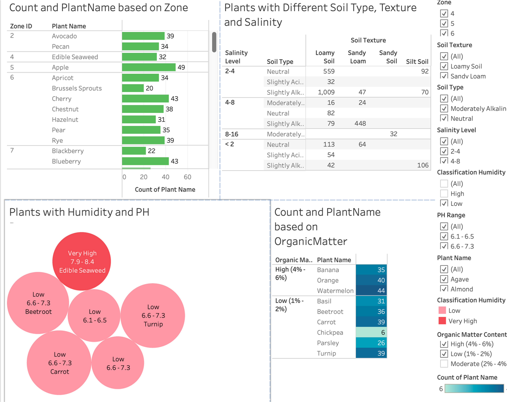
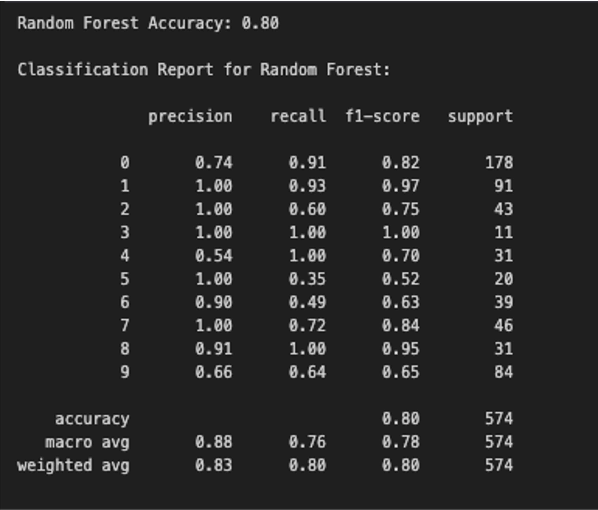
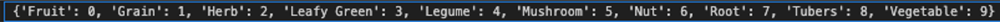
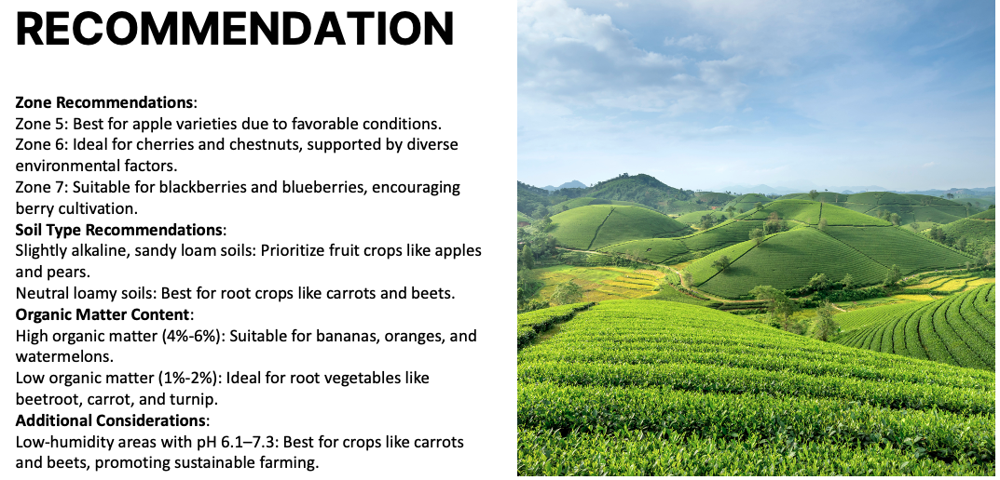

# Crop variety recommendation (predictive modeling)

Machine learning project that recommends plant varieties from growing conditions—soil, climate zone, humidity, salinity, organic matter, and related factors. Choosing varieties that fit local conditions supports higher yields, lower risk, and more efficient use of water and inputs.

**Recognition:** Developed for a Datathon; the team placed **2nd runner-up**. [View the digital badge](https://badgr.com/public/assertions/rpl3BidYQJKToosP9B4jLg?identity__email=ogupta@horizon.csueastbay.edu).

## Table of contents

- [Overview](#overview)
- [Project structure](#project-structure)
- [Technologies](#technologies)
- [Setup](#setup)
- [Run the notebook](#run-the-notebook)
- [How it works](#how-it-works)
- [Screenshots](#screenshots)
- [Example code](#example-code)
- [Features](#features)
- [Status](#status)
- [Challenges & learnings](#challenges--learnings)
- [Contact](#contact)

## Overview

The workflow loads and joins agricultural lookup tables, engineers features, and trains a **Random Forest** classifier with **Grid Search** hyperparameter tuning. The model is evaluated with accuracy metrics and confusion-matrix style visuals; results are framed as zone- and soil-aware variety recommendations.

## Project structure

```
Crop-variety-prediction/
├── README.md
├── images/              # EDA, model metrics, recommendation visuals
├── notebooks/
│   └── Datathon.ipynb   # Main analysis and modeling notebook
└── docs/                # Additional project materials
```

The notebook reads CSV files from a `data/` folder at the **repository root** (paths like `../data/…` from inside `notebooks/`). Add the Datathon dataset files there before running cells that load data.

## Technologies

- Python  
- pandas, NumPy  
- Matplotlib, Seaborn  
- scikit-learn (Random Forest, `GridSearchCV`)

## Setup

**1. Clone the repository**

```bash
git clone https://github.com/Siddiha/Crop-variety-prediction.git
cd Crop-variety-prediction
```

**2. Create a virtual environment (recommended)**

```bash
python -m venv .venv
```

- **Windows (PowerShell):** `.venv\Scripts\Activate.ps1`  
- **macOS / Linux:** `source .venv/bin/activate`

**3. Install dependencies**

```bash
pip install pandas numpy matplotlib seaborn scikit-learn jupyter
```

## Run the notebook

Start Jupyter from the `notebooks` directory so paths such as `../data/` resolve correctly:

```bash
cd notebooks
jupyter notebook Datathon.ipynb
```

Alternatively, open `notebooks/Datathon.ipynb` from JupyterLab or VS Code; if imports fail, set the kernel’s working directory to the `notebooks` folder or adjust the CSV paths in the first data-loading cells.

## How it works

1. **Load & explore** — Read lookup tables and the main plant table; exploratory analysis on distributions and relationships.  
2. **Preprocess** — Handle missing values, encode categoricals, normalize or scale where needed.  
3. **Feature engineering** — Merge lookups (zone, soil, pH, humidity, salinity, organic matter, variety) into a modeling table.  
4. **Train** — Random Forest with grid-searched hyperparameters.  
5. **Evaluate** — Accuracy and visual diagnostics (e.g. confusion matrix–style plots).

## Screenshots

### EDA and trends



Distribution of plant varieties across zones and related trends.

### Model accuracy





Confusion matrix and accuracy for the Random Forest model (~80% accuracy in the reported run).

### Recommendations



Recommendations aligned to zones, soil, and environmental factors.

## Example code

```python
from sklearn.ensemble import RandomForestClassifier
from sklearn.model_selection import GridSearchCV

rf = RandomForestClassifier()
param_grid = {"n_estimators": [100, 200], "max_depth": [10, 20]}
grid_search = GridSearchCV(rf, param_grid, cv=5)
grid_search.fit(X_train, y_train)
print(f"Best params: {grid_search.best_params_}")
```

## Features

**Current**

- Variety predictions from engineered environmental and soil inputs  
- Visual summaries for trends and model performance  
- Recommendations framed by zone, soil, and growing conditions  

**Possible next steps**

- Interactive assistant for farmer-facing Q&A  
- Stronger use of weather or forecast features in recommendations  

## Status

Initial version is complete; contributions and refinements are welcome.

## Challenges & learnings

- **Challenges:** Class imbalance affected metrics; grid search added compute time.  
- **Learnings:** End-to-end preprocessing and feature joins for tabular agronomic data; practical use of `GridSearchCV`; communicating results with clear plots.

## Contact

- **Email:** FathimaSiddka62@gmail.com
